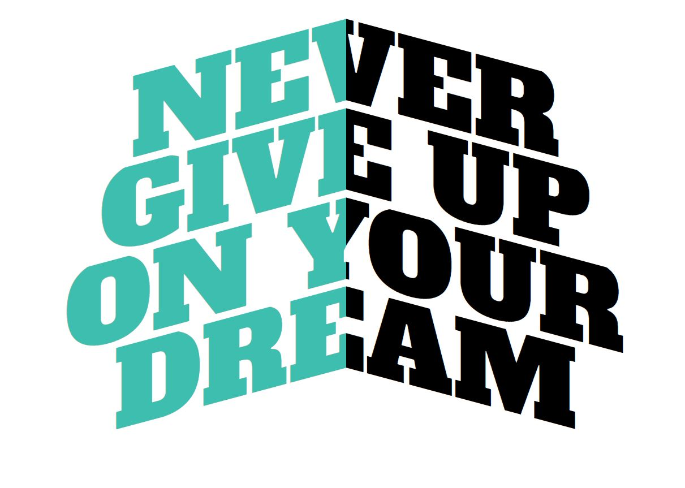

# TextFollowingMouse
When users move their mouse, this animation moves the text according to the mouse’s direction.
Create with Java Script, Css & HTML.

*You can try it [here](https://sh-anna.github.io/TextFollowingMouse/)

